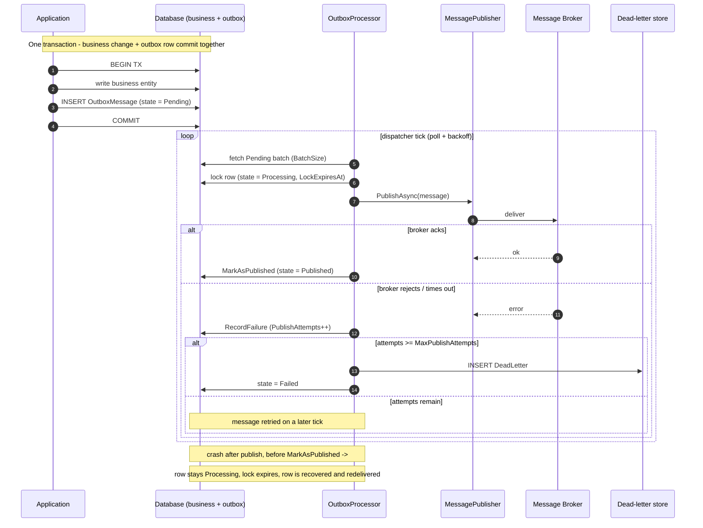

// existing content ...

## DeadLetterAdditionalTests

The `DeadLetterAdditionalTests` class provides additional comprehensive tests for the `DeadLetter` domain model. It verifies the correctness of various methods, including copying properties from an `OutboxMessage`, marking a dead letter as reviewed or requeued, and initializing a dead letter with all properties.

### Example Usage

```csharp
using DotnetOutboxPattern.Domain;
using DotnetOutboxPattern.Tests;
using System;

class Program
{
    static void Main()
    {
        var tests = new DeadLetterAdditionalTests();

        // Test copying properties from an OutboxMessage
        tests.FromOutboxMessage_WithAllProperties_CopiesCorrectly();

        // Test marking a dead letter as reviewed
        tests.MarkAsReviewed_WithEmptyNotes_SetsReviewedProperties();

        // Test marking a dead letter as requeued
        tests.MarkAsRequeued_WithEmptyReason_SetsRequeueProperties();
    }
}
```

## ModelsTests

The `ModelsTests` class provides a comprehensive set of unit tests for the domain models and DTOs used in the outbox message processing system. These tests verify the correctness of model initialization, property validation, and business logic across key types such as `OutboxProcessingResult`, `OutboxProcessorConfig`, `OutboxStatistics`, `PublishingOptions`, and `HealthMetrics`.

### Example Usage

```csharp
using DotnetOutboxPattern.Domain;
using DotnetOutboxPattern.Tests;
using System;

class Program
{
    static void Main()
    {
        var tests = new ModelsTests();

        // Test OutboxProcessingResult functionality
        tests.OutboxProcessingResult_DefaultConstructor_InitializesCollections();
        tests.OutboxProcessingResult_Duration_ReturnsCorrectTimeSpan();

        // Test OutboxProcessorConfig functionality
        tests.OutboxProcessorConfig_DefaultValues_AreCorrect();
        tests.OutboxProcessorConfig_CustomValues_AreApplied();

        // Test OutboxStatistics functionality
        tests.OutboxStatistics_DefaultValues_AreCorrect();
        tests.OutboxStatistics_SuccessRate_CalculatesCorrectly();
        tests.OutboxStatistics_SuccessRate_WithZeroTotal_ReturnsZero();

        // Test PublishingOptions functionality
        tests.PublishingOptions_DefaultValues_AreCorrect();
        tests.PublishingOptions_CustomValues_AreApplied();

        // Test HealthMetrics functionality
        tests.HealthMetrics_DefaultValues_AreCorrect();
        tests.HealthMetrics_UpdateProperties_WorksCorrectly();
    }
}
```

## MessageContextTests

The `MessageContextTests` class provides a set of unit tests for the `MessageContext` class, which is responsible for managing activities and events in the outbox message processing service. These tests verify the correctness of various methods, including getting or creating correlation and causation IDs, starting activities, recording events, and disposing of scopes.

### Example Usage

```csharp
using DotnetOutboxPattern.Tests;

class Program
{
    static void Main()
    {
        var tests = new MessageContextTests();

        // Run individual test methods
        tests.GetOrCreateCorrelationId_ReturnsValidGuidString();
        tests.GetOrCreateCausationId_WithActivity_ReturnsCurrentActivityId();
        tests.StartActivity_WithMessage_SetsCorrectTags();
        tests.RecordEvent_AddsEventToActivity();
        tests.RecordException_SetsExceptionTags();

        // Run all test methods
        tests.Run();
    }
}
```

## BatchProcessingBenchmarks

The `BatchProcessingBenchmarks` class provides a set of performance benchmarks for the outbox message processing service. It sets up an in-memory database, pre-loads a batch of messages, and measures the time taken to process pending messages or process a specific partition. The benchmarks are intended to help developers understand the throughput and latency characteristics of the outbox implementation under realistic workloads.

### Example

```csharp
using DotnetOutboxPattern.Benchmarks;
using System;
using System.Threading.Tasks;

class Program
{
    static async Task Main()
    {
        var benchmarks = new BatchProcessingBenchmarks { BatchSize = 100 };

        // Prepare the benchmark environment
        benchmarks.Setup();

        // Run the benchmark methods
        await benchmarks.ProcessPendingMessages();
        await benchmarks.ProcessPartitionMessages();

        // Clean up resources
        benchmarks.Cleanup();
        benchmarks.Dispose();
    }
}
```

## OutboxRepositoryBenchmarks

The `OutboxRepositoryBenchmarks` class provides performance benchmarks for the outbox repository operations, measuring the efficiency of message persistence and retrieval operations. It sets up a SQL Server database, initializes the outbox schema, and benchmarks common repository methods such as adding messages, retrieving pending messages in batches, checking message statistics, and counting pending messages.

### Example

```csharp
using DotnetOutboxPattern.Benchmarks;
using DotnetOutboxPattern.Domain;
using System;
using System.Threading.Tasks;

class Program
{
    static async Task Main()
    {
        var benchmarks = new OutboxRepositoryBenchmarks();

        // Prepare the benchmark environment
        benchmarks.Setup();

        // Add a single outbox message
        await benchmarks.AddSingleMessage();

        // Retrieve pending messages in batches of 100
        await benchmarks.GetPendingMessages_Batch100();

        // Retrieve pending messages for a specific partition
        await benchmarks.GetPendingMessagesByPartition_Batch100();

        // Get statistics about pending messages
        await benchmarks.GetStatistics();

        // Get count of pending messages
        await benchmarks.GetPendingCount();

        // Clean up resources
        benchmarks.Cleanup();
        benchmarks.Dispose();
    }
}
```

## OutboxServiceBenchmarks

The `OutboxServiceBenchmarks` class provides performance benchmarks for the outbox service operations, measuring the efficiency of message publishing and retrieval operations. It sets up a SQL Server database with the outbox schema and benchmarks common service methods such as publishing single events, publishing multiple events sequentially, retrieving message statistics, and fetching individual messages by ID.

### Example

```csharp
using DotnetOutboxPattern.Benchmarks;
using DotnetOutboxPattern.Domain;
using System;
using System.Threading.Tasks;

class Program
{
  static async Task Main()
  {
    var benchmarks = new OutboxServiceBenchmarks();

    // Prepare the benchmark environment
    benchmarks.Setup();

    // Publish a single domain event to the outbox
    await benchmarks.PublishSingleEvent();

    // Publish multiple domain events sequentially
    await benchmarks.PublishMultipleEvents_Sequential();

    // Get statistics about pending messages
    await benchmarks.GetStatistics();

    // Retrieve a specific message by its ID
    await benchmarks.GetMessageById();

    // Clean up resources
    benchmarks.Cleanup();
    benchmarks.Dispose();
  }
}
```
```

## RetryPolicyHelperTests

The `RetryPolicyHelperTests` class provides comprehensive unit tests for the `RetryPolicyHelper` class, which handles retry policy calculations for outbox message publishing. These tests verify various retry scenarios including fixed interval, linear backoff, exponential backoff, jitter, and edge cases like zero/negative attempts and maximum delay limits.

### Example Usage

```csharp
using DotnetOutboxPattern.Domain;
using DotnetOutboxPattern.Infrastructure;
using System;

class Program
{
    static void Main()
    {
        // Create publishing options with exponential backoff policy
        var options = new PublishingOptions
        {
            RetryPolicy = RetryPolicyType.ExponentialBackoff,
            InitialRetryDelay = TimeSpan.FromSeconds(1),
            BackoffMultiplier = 2,
            MaxRetryDelay = TimeSpan.FromSeconds(30),
            UseJitter = true
        };

        // Calculate delay for different attempts
        var delay1 = RetryPolicyHelper.CalculateDelay(1, options);
        var delay2 = RetryPolicyHelper.CalculateDelay(2, options);
        var delay3 = RetryPolicyHelper.CalculateDelay(3, options);

        Console.WriteLine($"Attempt 1 delay: {delay1.TotalSeconds:F2} seconds");
        Console.WriteLine($"Attempt 2 delay: {delay2.TotalSeconds:F2} seconds");
        Console.WriteLine($"Attempt 3 delay: {delay3.TotalSeconds:F2} seconds");

        // Calculate statistics for the retry policy
        var stats = RetryPolicyHelper.CalculateStatistics(options, maxAttempts: 5);
        Console.WriteLine($"Max attempts: {stats.MaxAttempts}");
        Console.WriteLine($"Total retries: {stats.TotalRetries}");
        Console.WriteLine($"Total delay: {stats.TotalDelayTime.TotalSeconds:F2} seconds");
        Console.WriteLine($"Average delay: {stats.AverageRetryDelay.TotalSeconds:F2} seconds");

        // Test edge cases
        try
        {
            RetryPolicyHelper.CalculateDelay(0, options);
        }
        catch (ArgumentException ex)
        {
            Console.WriteLine($"Expected exception for zero attempt: {ex.Message}");
        }
    }
}
```

## SystemTextJsonOutboxSerializerTests

The `SystemTextJsonOutboxSerializerTests` class provides comprehensive unit tests for the `SystemTextJsonOutboxSerializer` class, which handles serialization and deserialization of outbox messages using System.Text.Json. These tests verify constructor behavior, serialization of various data types (null values, primitives, strings, simple objects, complex objects), and deserialization with different scenarios including error cases.

### Example Usage

```csharp
using DotnetOutboxPattern.Services;
using System;
using System.Text.Json;

class Program
{
    static void Main()
    {
        // Create serializer with default options
        var serializer = new SystemTextJsonOutboxSerializer();

        // Test serialization of different types
        var nullResult = serializer.Serialize<object>(null);
        Console.WriteLine($"Serialized null: {nullResult}");

        var primitiveResult = serializer.Serialize(42);
        Console.WriteLine($"Serialized int: {primitiveResult}");

        var stringResult = serializer.Serialize("test string");
        Console.WriteLine($"Serialized string: {stringResult}");

        var simpleObject = new { Id = 123, Name = "Test" };
        var jsonResult = serializer.Serialize(simpleObject);
        Console.WriteLine($"Serialized object: {jsonResult}");

        // Test deserialization
        var deserializedInt = serializer.Deserialize<int>("42");
        Console.WriteLine($"Deserialized int: {deserializedInt}");

        var deserializedString = serializer.Deserialize<string>("\"test\"");
        Console.WriteLine($"Deserialized string: {deserializedString}");

        var deserializedObject = serializer.Deserialize<TestDto>(jsonResult);
        Console.WriteLine($"Deserialized object: Id={deserializedObject?.Id}, Name={deserializedObject?.Name}");

        // Create serializer with custom options
        var customOptions = new JsonSerializerOptions
        {
            PropertyNamingPolicy = JsonNamingPolicy.CamelCase,
            WriteIndented = true
        };
        var customSerializer = new SystemTextJsonOutboxSerializer(customOptions);
    }
}

// Example DTO for testing
public class TestDto
{
    public int Id { get; set; }
    public string? Name { get; set; }
}
```

## IntegrationTestFixture

The `IntegrationTestFixture` class provides a reusable test fixture that sets up an in-memory integration test environment for the Outbox Pattern application. It creates a WebApplicationFactory with an in-memory SQLite database and provides HTTP client access to test the application's API endpoints and services. The fixture manages the lifecycle of the test environment, including proper disposal of resources.

### Example Usage

```csharp
using DotnetOutboxPattern.Tests;
using System;
using System.Net;
using System.Net.Http.Json;
using System.Threading.Tasks;

class Program
{
    static async Task Main()
    {
        // Create the integration test fixture
        var fixture = new IntegrationTestFixture();

        try
        {
            // Initialize the fixture to create the HTTP client
            await fixture.InitializeAsync();

            // Use the fixture in your tests
            var response = await fixture.Client.GetAsync("/health");
            if (response.StatusCode == HttpStatusCode.OK)
            {
                Console.WriteLine("Application is healthy!");
            }

            // Create a service scope for resolving scoped services
            using var scope = fixture.CreateScope();
            var outboxService = scope.ServiceProvider.GetRequiredService<IOutboxService>();

            // Publish an event through the service
            var publishEvent = new PublishableEvent
            {
                Event = new EntityCreatedEvent { EntityId = "test-1", EntityType = "Order" },
                Topic = "orders.created",
                MaxAttempts = 3
            };

            var message = await outboxService.PublishEventAsync(publishEvent);
            Console.WriteLine($"Published message with ID: {message.Id}");
        }
        finally
        {
            // Dispose the fixture to clean up resources
            await fixture.DisposeAsync();
        }
    }
}
```

## Outbox lifecycle

The transactional outbox turns "update my database and tell the outside world"
into a single atomic step. The message row is written in the **same** transaction
as the business change, so it can never be lost even if the process dies before
the broker is contacted. A separate dispatcher then relays the row to the broker
and marks it published.



Key guarantees this implies:

- **At-least-once delivery.** A crash in the window between a successful broker
  publish and the local `MarkAsPublished` commit causes the row to be redelivered
  on restart. Consumers must deduplicate on `IdempotencyKey`.
- **No lost messages.** Because the outbox row is committed in the business
  transaction, a message is never lost even if the dispatcher never got a turn.
- **Bounded retries.** A message that keeps failing is retried up to
  `MaxPublishAttempts` and then moved to the dead-letter store instead of looping
  forever.

These are exercised end-to-end in `OutboxEndToEndTests` (crash-before-dispatch,
crash-after-publish redelivery, steady-state dedup) and
`PoisonMessageDeadLetterTests` (retry exhaustion to dead-letter).

## When NOT to use this pattern

The outbox is not free - it adds a table, a polling dispatcher, and end-to-end
latency. Reach for something else when:

- **You need low, predictable latency.** Polling adds delay between commit and
  delivery. If you need sub-100ms fan-out, a direct broker publish (accepting the
  dual-write risk, or using broker transactions / CDC) fits better.
- **Your datastore has no transactions spanning the business write and the outbox
  write.** The whole guarantee rests on that single atomic commit. If the business
  data and the outbox table cannot share a transaction, the pattern buys you
  nothing.
- **You already have change-data-capture (CDC).** Tailing the transaction log
  (Debezium, SQL Server CDC, Postgres logical replication) gives the same
  at-least-once guarantee without a hand-rolled dispatcher or the extra write.
- **The side effect is not a message.** The outbox reliably emits *events*. It
  does not make an arbitrary external call (charge a card, call a REST API)
  transactional - wrap those in their own idempotency / saga handling.
- **You cannot make consumers idempotent.** At-least-once means duplicates are
  expected. If downstream consumers cannot dedupe (no idempotency key, non-
  idempotent side effects), the duplicates will cause real damage.
- **Throughput dwarfs a single relational table.** At very high sustained event
  rates the outbox table and its polling become the bottleneck; a purpose-built
  streaming platform (Kafka with transactions) is the better tool.

Rule of thumb: use the outbox when you own a transactional database, you are
emitting domain events, and correctness (never losing an event) matters more than
shaving the last few milliseconds of latency.
